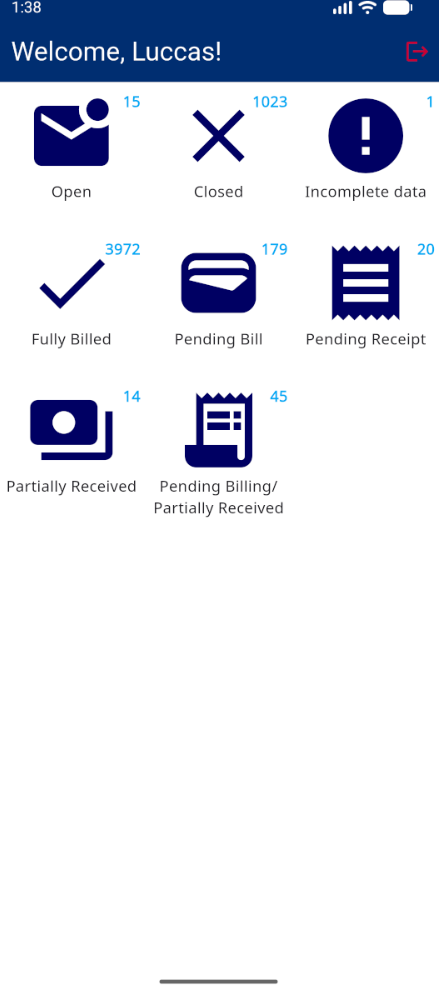
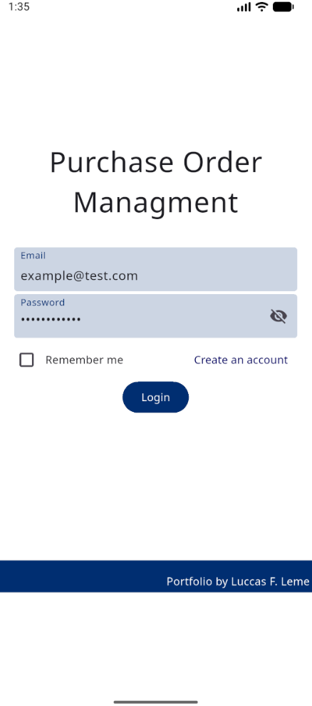
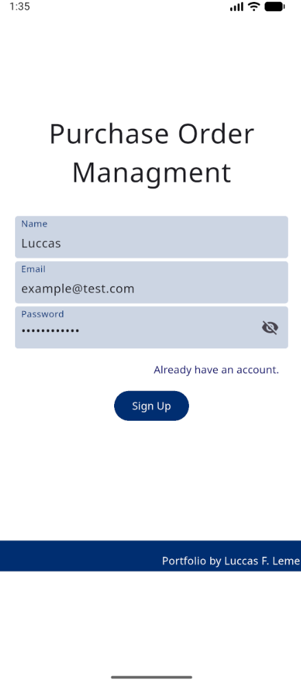
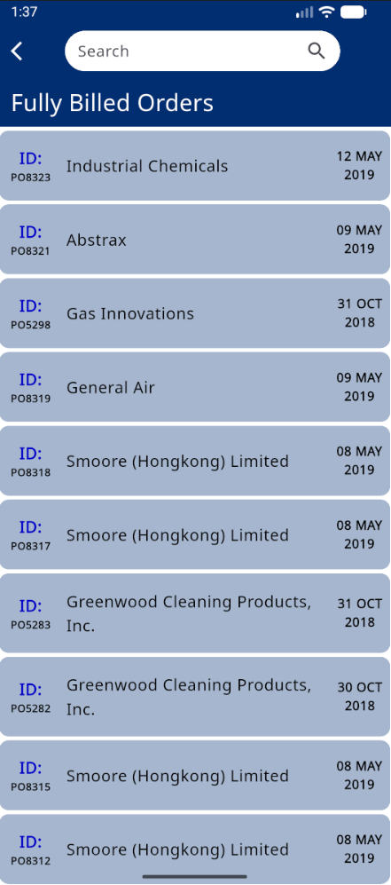
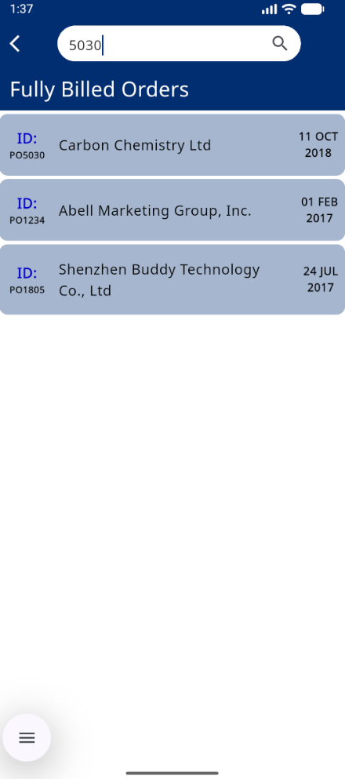
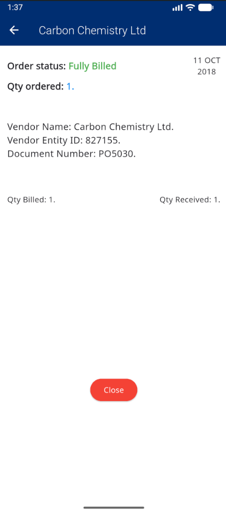
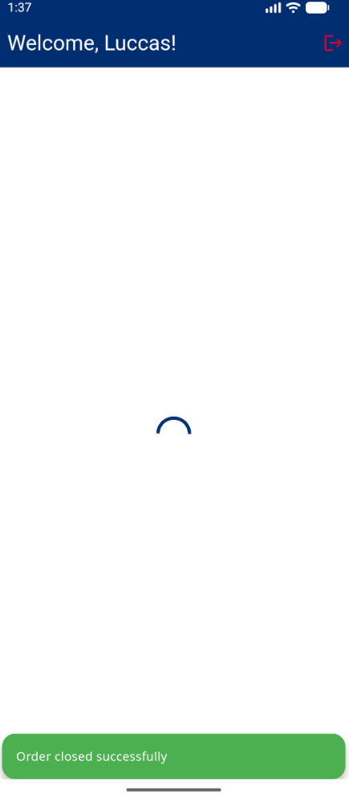

# Purchase Order Management System

## Overview

A Flutter mobile application for purchase order management, built on MVVM architecture and Firebase backend.

---

## Data Source

The app data was sourced from an Excel file containing purchase order data. The workflow:

1. **Excel Sheet** - Raw data with vendor information, order numbers, quantity, and status
2. **Converted to Dart** - Converted and processed into Dart objects
3. **Uploaded to Firebase** - Uploaded into Firestore database with the structured data

This is a sample real-world data migration scenario from pre-existing spreadsheets to a new cloud database.

---

## Backend: Firebase

Firebase provides the complete backend stack:

- **Firebase Authentication** - email/password login-based user authentication
- **Cloud Firestore** - NoSQL database of users and orders
- **Security Rules** - server-side security rules

**Data Structure:**
```
/users/{userId}          - User profiles
/orders/allOrders        - Purchase order records
```

---

## Architecture: MVVM

This project adheres to **Model-View-ViewModel** pattern best practices with Clean Architecture.

### MVVM Layers

```
VIEW (UI)
↕
VIEWMODEL (State Management)
↕
MODEL (Business Logic + Data)
```

**Components:**
- **Model**: Domain models, use cases, repositories, Firebase data sources
- **View**: Flutter pages and widgets
- **ViewModel**: Riverpod StateNotifiers of state

### Project Structure

```
lib/
├── core/                  # Shared infrastructure
```
├── features/             # Feature modules
│   ├── auth/
│   │   ├── data/         # Firebase implementation
│   │   ├── domain/       # Business logic
│   │   └── presentation/ # UI + ViewModel
│   └── orders/
│       ├── data/
│       ├── domain/
│       └── presentation/
└── routes/               # Navigation

---

## Technical Stack

- **Framework**: Flutter 3.x
- **Language**: Dart 3.x
- **Architecture**: MVVM + Clean Architecture
- **State Management**: Riverpod
- **Navigation**: GoRouter
- **Backend**: Firebase (Auth + Firestore)
- **Error Handling**: Either pattern (dartz)

---

## Features

- Email/password authentication
- Auto-login with secure credential storage
- Order dashboard with status grouping
- Search and filter functionality
- Order detail views
- Update order status (Open/Close)
- Real-time Firebase synchronization

---

## Key Implementations

**MVVM Pattern**
- Decoupled UI, state, and business logic
- Immutable state objects with copyWith pattern
- Reactive UI updates with Riverpod

**Security**
- Firebase Authentication
- Firestore Security Rules
- Encrypted local storage

**Design Patterns**
- Repository Pattern
- Use Case Pattern
- Dependency Injection
- Immutable State

---

## Portfolio Screenshots

This section showcases the key features and user interface of the Purchase Order Management application.

### 1. Dashboard Overview


The main dashboard displays comprehensive order statistics:
- **Order Status Categories**: Open (15), Closed (1023), Incomplete data (1)
- **Billing Status**: Fully Billed (3972), Pending Bill (179), Pending Receipt (20)
- **Receipt Status**: Partially Received (14), Pending Billing/Partially Received (45)

This dashboard provides users with a real-time overview of all purchase orders and their current states, enabling quick decision-making and workflow management.

### 2. Authentication Flow



Secure authentication system featuring:
- Email/password login
- "Remember me" functionality with secure local storage
- Account creation flow
- Password visibility toggle
- Firebase Authentication integration

### 3. Order Management



The order list view includes:
- **Real-time Search**: Quick search by order ID or vendor name (demonstrated with "5030" query filtering results)
- **Dynamic Filtering**: Search results update instantly as users type
- **Order Cards**: Each displaying Order ID, Vendor Name, and Date
- **Status-based Filtering**: View by Fully Billed, Pending Bill, etc.
- **Scrollable List**: Easy navigation through large datasets
- **Search Persistence**: Search bar available across all order status views

### 4. Order Details


Detailed order view showing:
- **Order Status**: Fully Billed (displayed in green)
- **Order Information**: Quantity ordered (1)
- **Vendor Details**: Name (Carbon Chemistry Ltd.), Entity ID (827155), Document Number (PO5030)
- **Quantities**: Qty Billed (1), Qty Received (1)
- **Action Button**: "Close" button to update order status
- **Date**: Order date (11 OCT 2018)

### 5. Status Update Flow



The status update demonstrates:
- **Loading state**: Visual feedback during Firebase transaction
- **Success notification**: Bottom banner confirming "Order closed successfully"
- **Real-time sync**: Immediate reflection in dashboard statistics (Open count decreased from 15 to 14, Closed increased from 1022 to 1023)

---

## User Workflow Demonstrated

The screenshots above illustrate a complete user journey:

1. **Login** → User authenticates with credentials
2. **Dashboard** → User views overall order statistics
3. **Order List** → User searches and browses orders by status
4. **Order Detail** → User reviews specific order information
5. **Status Update** → User closes an order, triggering a Firebase update
6. **Success Feedback** → User receives confirmation and sees updated dashboard

This workflow showcases the application's ability to handle real-world purchase order management tasks efficiently.

---

This portfolio project showcases professional Flutter development with MVVM
architecture and Firebase backend integration.


 


  